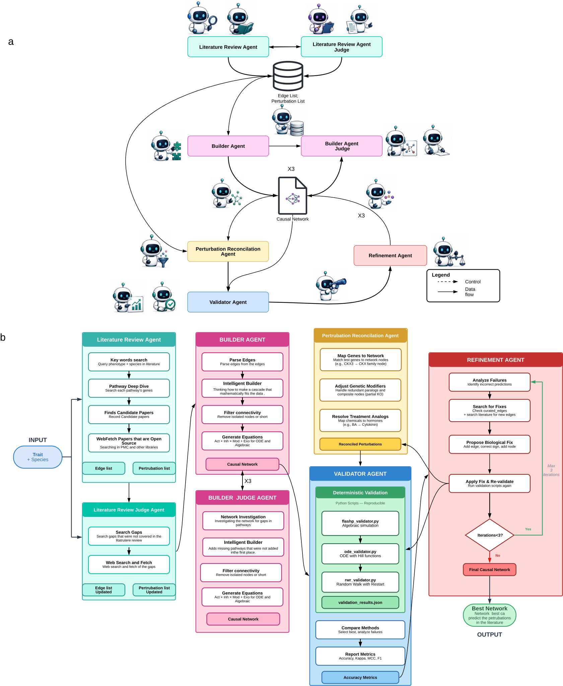
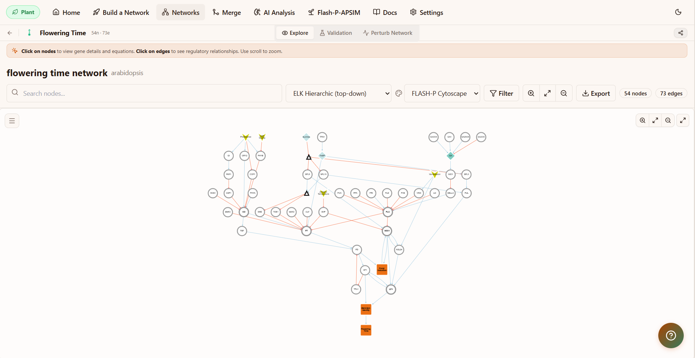

<p align="center">
  
</p>

<h1 align="center">FLASH-P</h1>

<p align="center">
  <em>A multi-agent system that turns primary literature into validated,
  perturbation-testable causal networks &mdash; for any trait, in any species.</em>
</p>

<p align="center">
  <a href="#what-is-flash-p">What it is</a> &nbsp;&middot;&nbsp;
  <a href="#versions">Versions</a> &nbsp;&middot;&nbsp;
  <a href="#how-to-run">How to run</a> &nbsp;&middot;&nbsp;
  <a href="#commands">Commands</a> &nbsp;&middot;&nbsp;
  <a href="#whats-in-this-repo">Repo</a> &nbsp;&middot;&nbsp;
  <a href="#flash-p-gui--coming-soon">GUI</a>
</p>

---

## What is FLASH-P?

FLASH-P reads primary scientific literature straight from the web and turns it into a validated,
perturbation-testable causal network for any (trait, species) pair. A sequence of specialised
agents &mdash; literature reviewer &rarr; judge &rarr; builder &rarr; judge &rarr; perturbation &rarr; validator &rarr; refiner &rarr;
exporter &mdash; pass strict handoff files to each other. Every edge carries a DOI; every node is wired
into algebraic, Hill-function ODE, and signed Random-Walk-with-Restart equations, so the network
is both human-readable and numerically simulable.

> **See it for yourself at [https://flash-p.com/](https://flash-p.com/)** &mdash; browse the
> networks, run perturbations, and explore the outcomes. Click through to get a feel for what
> FLASH-P builds.

The agents are just plain-text prompts plus structured handoff files &mdash; nothing in them is tied to
one model or tool. **The same pipeline runs inside any coding agent that reads a `CLAUDE.md` or
`AGENTS.md` file** &mdash; we ship ready-to-go folders for Claude Code, Codex CLI, and OpenCode (which
also covers Aider, Goose, and any other AGENTS.md-aware tool).

<p align="center">
  
</p>

FLASH-P has already built **hundreds of networks**. The **13** shipped in [`Outcome/`](Outcome)
are the ones from the paper &mdash; built with the paper version of the agents: six Arabidopsis
phenotype networks, one merged six-trait network, and six other-species networks (*E. coli*, maize,
poplar, rice, sorghum, wheat). On a like-for-like benchmark they reach higher direction-call
accuracy than a cleaned knowledge-base baseline at a fraction of the size &mdash; see
[`Outcome/FLASH-P_VS_KG/`](Outcome/FLASH-P_VS_KG).

---

## Versions

Pick the folder for your domain, then open the subfolder for your coding agent.

| Version | Use it for | Notes |
|---|---|---|
| **[`Flash-P_Plant/`](Flash-P_Plant)** | Plant & crop traits | **Start here.** The lean, current pipeline, tested most extensively. Ships Claude Code, Codex, and OpenCode variants. |
| **[`Flash-P_Medical/`](Flash-P_Medical)** | Medical traits | Same pipeline, medical tuning. Works, but **not yet tested as extensively** as Plant. Claude Code setup. |
| **[`Flash-P_Animal/`](Flash-P_Animal)** | Animal traits | Same pipeline, animal tuning. Works, but **not yet tested as extensively** as Plant. Claude Code setup. |
| **[`Flash-P_Paper_Version/`](Flash-P_Paper_Version)** | Reproducing the manuscript | The **original** pipeline behind the paper &mdash; full provenance and multi-pass judges, so **heavy on tokens**. Kept for reproducibility. The current versions above are far leaner with the same science. |

> **In short:** the current versions are very lean and fit a normal session; the paper version is
> the heavier original, kept only so the published results can be reproduced.

---

## How to run

Open the version folder for your domain, then the subfolder for your coding agent, and run the
pipeline for a trait and species (e.g. *Shoot Branching* in *Arabidopsis*).

### Claude Code

```bash
# install agentic coding platform (e.g. Claude Code)
npm install -g @anthropic-ai/claude-code   # or get the desktop app: https://www.claude.com/product/claude-code

# Download Flash-P from github. No actual installation required
git clone https://github.com/CMits/FlashP.git

# run your agent platform from the correct directory within Flash-P
cd FlashP/Flash-P_Plant/Claude
claude
```

Then run:

```text
/run-flashp Shoot Branching in Arabidopsis
```

It runs the whole pipeline (Steps 1&rarr;6) autonomously and writes the network, validation, and
supplementary tables into a new `networks/<trait>/` folder.

### Codex / OpenCode / Aider / Goose

Open the matching subfolder &mdash; `Flash-P_Plant/Codex/` or `Flash-P_Plant/OpenCode_Aider_Any_Other/` &mdash;
start your agent there, and paste:

```text
Run the full FLASH-P pipeline for <trait> in <species>.
```

> **Open the agent subfolder, not the repo root** &mdash; the pipeline reads its orchestrator file
> (`CLAUDE.md` / `AGENTS.md`) and `Agent/*.md` as relative paths.
>
> **Medical & Animal** currently ship the Claude Code setup (`CLAUDE.md` + `Agent/`); open that
> folder in Claude Code and use the same `/run-flashp` command.

---

## Commands

Once your agent is running in a version folder (e.g. `Flash-P_Plant/Claude`), these slash commands are
available. Run **`/run-flashp-help`** at any time to print this list from inside Claude Code.

| Command | What it does | Usage |
|---|---|---|
| `/run-flashp` | Autonomously run the full pipeline (Steps 1&rarr;6) for a trait and write the network, validation, and supplementary tables into `networks/<trait>/`. | `/run-flashp <trait> in <species>` |
| `/run-flashp-visualise` | Render a built network as a website-faithful **interactive HTML** (clickable, DOI links) plus static SVG + PNG. | `/run-flashp-visualise <network dir>` |
| `/run-flashp-perturb` | Build the **FLASH-P Studio** &mdash; one self-contained, offline HTML app to browse, view, and **perturbate** all your networks (KO/KD/OE + treatments; Algebraic / RWR / ODE solvers, live charts). | `/run-flashp-perturb <networks dir>` |
| `/run-flashp-epistasis` | Gene &times; gene epistasis scan over an existing network &mdash; every single + double perturbation, classified by interaction. *(Plant)* | `/run-flashp-epistasis <network dir>` |
| `/run-flashp-gxe` | Gene &times; environment (G&times;E) scan over an existing network &mdash; dose-swept, with a report. *(Plant)* | `/run-flashp-gxe <network dir>` |
| `/run-flashp-help` | Print this command list from inside Claude Code (auto-generated from the commands available in the folder). | `/run-flashp-help` |

> `/run-flashp`, `/run-flashp-visualise`, `/run-flashp-perturb`, and `/run-flashp-help` ship in **Plant,
> Animal, and Medical**; `/run-flashp-epistasis` and `/run-flashp-gxe` currently ship in the **Plant**
> variant.

---

## What's in this repo

| Folder | Contents |
|---|---|
| `Flash-P_Plant/`, `Flash-P_Medical/`, `Flash-P_Animal/` | The latest versions (see [Versions](#versions)). |
| `Flash-P_Paper_Version/` | The original heavy-token pipeline used for the manuscript. |
| [`Outcome/`](Outcome) | All paper outputs: every network, validation result, refinement history, Cytoscape export, the KG-baseline comparison, and a local open-source-model reproduction. |
| [`Supplementary Data/`](Supplementary%20Data) | Seven supplementary `.xlsx` tables with build scripts and per-dataset descriptions. |
| [`Images/`](Images) | Banner, pipeline diagram, and GUI preview. |

### Visualise in Cytoscape

Every network in [`Outcome/Networks/`](Outcome/Networks) ships as `.graphml` &mdash; drop one onto
Cytoscape and import [`Style_Cytoscape.xml`](Outcome/Networks/Style_Cytoscape.xml) (style
**FLASH-P**) to render it with the published palette. Full recipe in
[`Outcome/Networks/README.md`](Outcome/Networks/README.md).

---

## FLASH-P GUI &mdash; coming soon

<p align="center">
  
</p>

A no-install desktop app is in development: build, browse, edit, save, and merge networks; run
AI-driven analyses across many networks at once; and chat with your networks in natural language &mdash;
all with a built-in model picker (OpenAI, Anthropic, Gemini, Kimi, DeepSeek, Qwen, or any local
model). Stay tuned at <https://flash-p.com/>. **Status: not yet released.**

---

## Creators

**Christos Mitsanis** &middot; **David Kainer** &mdash; *The University of Queensland*

## Contact

- **Christos Mitsanis** &mdash; [c.mitsanis@uq.edu.au](mailto:c.mitsanis@uq.edu.au)
- **David Kainer** &mdash; [d.kainer@uq.edu.au](mailto:d.kainer@uq.edu.au)
- Or open a [GitHub issue](https://github.com/CMits/FlashP/issues).

## License

&copy; 2026 **The University of Queensland**, released under
[CC BY-NC-SA 4.0](LICENSE) &mdash; free to share and adapt for non-commercial use with attribution and
share-alike. If you use FLASH-P in academic work, please cite:
> Mitsanis C, Fortuna NZ, Beveridge C, Kainer D. **Turning decades of biology into accurate
> causal networks with AI agents.** _bioRxiv_ 2026.06.13.731799;
> doi: [10.64898/2026.06.13.731799](https://doi.org/10.64898/2026.06.13.731799)
